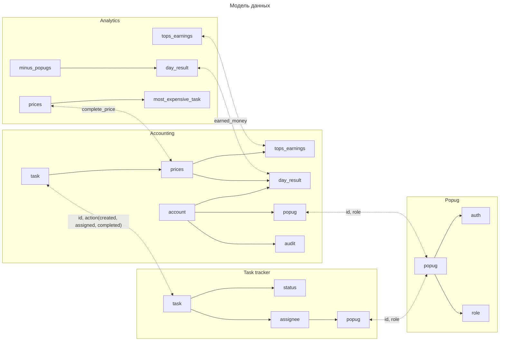

```mermaid
---
title: Event Storming
---
flowchart LR
       
    subgraph Попугаус
        
        
        subgraph Регистрация нового попуга
            PA([Popug Admin]):::actor --> C_Register[Register]:::command
            C_Register --> E_PopugCreated(PopugCreated):::event
        end
        subgraph Авторизация
            UP([Unknown popug]):::actor
            UP --> C_Auth_acc[AuthAccounting]:::command
                        
            UP --> C_Auth_tr[AuthTracker]:::command
                        
            UP --> C_Auth_anal[AuthAnalitics]:::command
            
        end
    end
    
    subgraph Трекер задач
        subgraph Акторы трекра
            C_Auth_tr --> P_any_tr([Any Popug]):::actor
            C_Auth_tr --> PW_tr([Popug Worker]):::actor
            C_Auth_tr --> PM_tr([Popug Manager]):::actor
        end
        subgraph Узнали о новом попуге
            E_PopugCreated --> C_StorePopugInfo_Tracker["Store popug info"]:::command
        end
        
        subgraph Просмотр дашборда задач
            PW_tr <--> Q_GetTasks[Get my tasks]:::query
        end

        subgraph Новая задача
            P_any_tr --> C_CreateTask[Create task]:::command
            C_CreateTask --> E_TaskCreated(TaskCreated):::event
        end

        subgraph Заасайнить задачи
            PM_tr --> C_AssignAllTasks[Assign all tasks]:::command
            Q_GetActiveTasks[Get active tasks]:::query <--> C_AssignAllTasks
            C_AssignAllTasks --> E_AssignRequested(TaskAssignRequested):::event
        end

        subgraph Ассайн задачи
            E_TaskCreated --> C_Assign[Assign to random popug]:::command
            E_AssignRequested --> C_Assign
            Q_PopugWorkers[Get popug workers]:::query <--> C_Assign
            C_Assign --> E_TaskAssigned(TaskAssigned):::event
        end

        subgraph Выполнить задачу 
            PW_tr --> C_CompleteTask[Complete Task]:::command
            C_CompleteTask --> E_TaskCompleted(TaskCompleted):::event
        end
    end
    
    subgraph Аккаунтинг 
        subgraph Акторы аккаунтинга
            C_Auth_acc --> PW_acc([Popug Worker]):::actor
            C_Auth_acc --> PA_acc([Popug Admin]):::actor
            C_Auth_acc --> PB_acc([Popug Buh]):::actor
            J_FinalizeDayJob([FinalizeDayJob]):::actor
        end

        subgraph Информация по заработку топов
            PA_acc <--> Q_GetEarnedForTops[Get earned for tops]:::query
            PB_acc <--> Q_GetEarnedForTops
        end
        
        subgraph Текущий баланс попуга
            PW_acc <--> Q_GetPopugBalance[Get popug balance]:::query
        end
        
        subgraph Списания и начисления
            PW_acc <--> Q_GetAudit[Get audit]:::query
        end
        
        subgraph Узнали о новом попуге
            E_PopugCreated --> C_CreateBillAccount[Create bill account]:::command
        end

        subgraph Аудит лог
            C_StoreAudit[Сохраняем лог]:::command
        end

        subgraph Заканичваем день
            J_FinalizeDayJob --> C_RunDayFin[Run day finalization]:::command
            C_RunDayFin <--> Q_GetWorkingPopugs[Get working popugs]:::query
            C_RunDayFin --> E_FinalizeDay(FinalizeDayRequested):::event
            C_RunDayFin --> C_FinalizeTopsEarnings[Finalize tops earnings]:::command
            C_FinalizeTopsEarnings --> E_FinalizedDayTopsEarned(FinalizedDayTopsEarned):::event
            C_FinalizeTopsEarnings <--> Q_GetEarnedForTops
        end

        subgraph Заканчиваем день у попуга 
            E_FinalizeDay --> C_FinalizePopugDay[Finalize popug day]:::command
            Q_GetPopugBalance <--> C_FinalizePopugDay
            C_FinalizePopugDay -->|if positive| C_ZeroBalance[Zero balance]:::command
            C_FinalizePopugDay --> E_DayFinalized(DayFinalized):::event
            C_FinalizePopugDay --> C_StoreAudit
        end

        subgraph Отправляем письмо
            E_DayFinalized --> C_BuildEmailAboutSalary[Build email about salary]:::command
            C_BuildEmailAboutSalary --> E_SendEarnedEmail(Send earned email):::event
        end

        subgraph Рассчитываем стоимость задачи
            E_TaskCreated --> C_CalcTaskPrices[Calc task prices]:::command
        end

        subgraph Списываем с попуга стоимость ассайна и сохраняем лог
            E_TaskAssigned --> C_BillTaskAssign[Write off by task assign]:::command
            Q_GetTaskAssignPrice[Get task assign price]:::query <--> C_BillTaskAssign
            C_BillTaskAssign --> C_WriteOffFromPopug[Write off from popug]:::command
            C_BillTaskAssign --> C_DepositToTops[Deposit to tops]:::command
            C_BillTaskAssign --> C_StoreAudit
        end

        subgraph Зачисляем попугу заработанные деньги за выполнение задачи и сохраняем лог
            E_TaskCompleted --> C_BillTaskComplete[Deposit by task complete]:::command
            Q_GetTaskCompletePrice[Get task complete price]:::query <--> C_BillTaskComplete
            C_BillTaskComplete --> C_WriteOffFromTops[Write off from tops]:::command
            C_BillTaskComplete --> C_DepositToPopug[Deposit to popug]:::command
            C_BillTaskComplete --> E_TaskCompletionBilled[TaskCompletionBilled]:::event
            C_BillTaskComplete --> C_StoreAudit
        end
        
    end
    
    subgraph Аналитика
        subgraph Акторы аналитики
            C_Auth_anal --> PA_anal([Popug Admin]):::actor
        end
        subgraph Заработок топов
            PA_anal <--> Q_GetTopsEarnings[Get tops earnings]:::query
        end
        
        subgraph Попуги-минуса
            PA_anal <--> Q_GetMinusPopugs[Get minus popugs]:::query
        end

        subgraph Самая дорогая задача
            PA_anal <--> Q_GetMostExpensive[Get most expensive task]:::query
        end

        subgraph Фиксируем самую дорогую задачу
            E_TaskCompletionBilled --> C_AddMostExpensiveTask[Add most expensive task if need]:::command
        end
        
        subgraph Результаты попуг дня 
            E_DayFinalized --> C_AddMinusPopug[Add minus popug if need]:::command
        end
        
        subgraph Заработок топов за день 
            E_FinalizedDayTopsEarned --> C_StoreTopsEarning[Store tops earning]:::command
        end
    end
    
    classDef event fill:orange,color:black
    classDef actor fill:lightyellow,color:black
    classDef command fill:lightblue,color:black
    classDef query fill:lightgreen,color:black
```


# Сервисы
## Попугаус (Auth Service)
* Синхронные запросы авторизации из других сервисов
* Асинхронные события о создании/изменении попуга
## Task Tracker
* Синхронные запросы для просмотра дашборда
* Асинхронные события о создании/изменении задания
## Accounting
* Синхронные запросы для просмотра дашборда
* Асинхронные события о финансовых операциях в сервисе
## Analytics
* Синхронные запросы для просмотра дашборда

# Бизнес события
## TaskCreated
* Producer: Task Tracker
* Consumers: Task Tracker, Accounting
## TaskAssigned
* Producer: Task Tracker
* Consumers: Accounting
## TaskCompleted
* Producer: Task Tracker
* Consumers: Accounting
## DayFinalized
* Producer: Accounting
* Consumer: Analytics, Email Service (Accounting)

# CUD
## PopugCreated
* Producer: Попугаус
* Consumers: Task Tracker, Accounting
* Data: PopugId, Role
## TaskAssignRequested
* Producer: Task Tracker
* Consumers: Task Tracker
* Data: TaskId
## TaskCompletionBilled
* Producer: Accounting
* Consumer: Analytics
* Data: CompletionPrice
## FinalizeDayRequested
* Producer: Accounting
* Consumers: Accounting
* Data: PopugId
## FinalizedDayTopsEarned
* Producer: Accounting
* Consumer: Analytics
* Data: TopsEarnedMoney