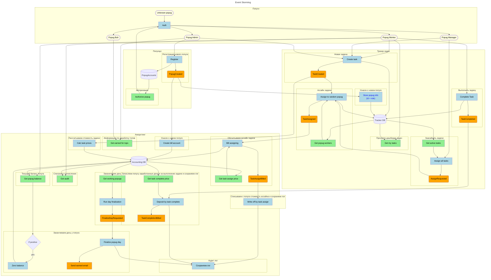

```mermaid
---
title: Event Storming
---
%%{init: {"flowchart": {"htmlLabels": false}} }%%
flowchart 
       
    subgraph Попуги
        UP([Unknown popug]):::actor
        PW([Popug Worker]):::actor
        PA([Popug Admin]):::actor
        PM([Popug Manager]):::actor
        PB([Popug Buh]):::actor
        UP --> C_Auth[Auth]:::command
        C_Auth --> PW
        C_Auth --> PA
        C_Auth --> PM
        C_Auth --> PB
    end

    subgraph Попугаус
        subgraph Регистрация нового попуга
            PA --> C_Register[Register]:::command
            C_Register --> E_PopugCreated(PopugCreated):::event
        end
        subgraph Авторизация
            Q_AuthPopug[Authorize popug]:::query --> C_Auth 
        end

        C_Register --> DB_Auth[(PopugAccounts)]
        DB_Auth --> Q_AuthPopug
    end
    
    subgraph Трекер задач

        subgraph Узнали о новом попуге
            E_PopugCreated --> C_StorePopugInfo_Tracker["`
            <span style='color:blue'>Store popug info 
            (id + role)</span>`"]:::command
        end
        
        subgraph Просмотр дашборда задач
            PW --> Q_GetTasks[Get my tasks]:::query
        end

        subgraph Новая задача
            PW --> C_CreateTask[Create task]:::command
            PM --> C_CreateTask
            PA --> C_CreateTask
            C_CreateTask --> E_TaskCreated(TaskCreated):::event
        end

        subgraph Заасайнить задачи
            PM --> C_AssignAllTasks[Assign all tasks]:::command
            Q_GetActiveTasks[Get active tasks]:::query --> C_AssignAllTasks
            C_AssignAllTasks --> E_AssignRequested(AssignRequested):::event
        end

        subgraph Ассайн задачи
            E_TaskCreated --> C_Assign[Assign to random popug]:::command
            E_AssignRequested --> C_Assign
            Q_PopugWorkers[Get popug workers]:::query --> C_Assign
            C_Assign --> E_TaskAssigned(TaskAssigned):::event
        end

        subgraph Выполнить задачу 
            PW --> C_CompleteTask[Complete Task]:::command
            C_CompleteTask --> E_TaskCompleted(TaskCompleted):::event
        end

        %%query
        DB_Tracker[(Tracker DB)] --> Q_GetTasks
        DB_Tracker --> Q_PopugWorkers
        DB_Tracker --> Q_GetActiveTasks
        %%mutable
        C_Assign --> DB_Tracker
        C_CreateTask --> DB_Tracker
        C_StorePopugInfo_Tracker --> DB_Tracker
        C_CompleteTask --> DB_Tracker
    end
    
    subgraph Аккаунтинг 
        subgraph Текущий баланс попуга 
            PW --> Q_GetPopugBalance[Get popug balance]:::query
        end
        
        subgraph Списания и начисления 
            PW --> Q_GetAudit[Get audit]:::query
        end
        
        subgraph Информация по заработку топов 
            PA --> Q_GetEarnedForTops[Get earned for tops]:::query
            PB --> Q_GetEarnedForTops
        end
        
        subgraph Узнали о новом попуге
            E_PopugCreated --> C_CreateBillAccount[Create bill account]:::command
        end
        
        subgraph Рассчитываем стоимость задачи 
            E_TaskCreated --> C_CalcTaskPrices[Calc task prices]:::command
        end
        
        subgraph Обсчитываем ассайн задачи
            E_TaskAssigned --> C_BillAssign[Bill assigning]:::command
            Q_GetTaskAssignPrice[Get task assign price]:::query --> C_BillAssign
            C_BillAssign --> E_TaskAssignBilled(TaskAssignBilled):::event
        end
        
        subgraph Аудит лог
            C_StoreAudit[Сохраняем лог]:::command
        end
        
        subgraph Списываем с попуга стоимость ассайна и сохраняем лог
            E_TaskAssignBilled --> C_WriteOffByTaskAssign[Write off by task assign]:::command
            C_WriteOffByTaskAssign --> C_StoreAudit
        end
        
        subgraph Зачисляем попугу заработанные деньги за выполнение задачи и сохраняем лог
            E_TaskCompleted --> C_DepositByTaskComplete[Deposit by task complete]:::command
            Q_GetTaskCompletePrice[Get task complete price]:::query --> C_DepositByTaskComplete
            C_DepositByTaskComplete --> E_TaskCompletionBilled[TaskCompletionBilled]:::event
            C_DepositByTaskComplete --> C_StoreAudit
        end
        
        subgraph Заканичваем день
            Q_GetWorkingPopugs[Get working popugs]:::query --> C_RunDayFin
            C_RunDayFin[Run day finalization]:::command --> E_FinalizeDay(FinalizeDayRequested):::event
        end
        
        subgraph Заканчиваем день у попуга 
            E_FinalizeDay --> C_FinalizePopugDay[Finalize popug day]:::command
            Q_GetPopugBalance --> if_positive{If positive}
            if_positive -->|yes| C_ZeroBalance[Zero balance]:::command
            C_FinalizePopugDay --> E_SendEarnedEmail[Send earned email]:::event
            C_FinalizePopugDay --> C_StoreAudit
        end
        
        
        %%query
        DB_Accounting[(Accounting DB)] --> Q_GetPopugBalance
        DB_Accounting --> Q_GetAudit
        DB_Accounting --> Q_GetTaskAssignPrice
        DB_Accounting --> Q_GetTaskCompletePrice
        DB_Accounting --> Q_GetWorkingPopugs
        %%mutable
        C_CreateBillAccount --> DB_Accounting
        C_CalcTaskPrices --> DB_Accounting
        C_BillAssign --> DB_Accounting
        C_ZeroBalance --> DB_Accounting
    end
    
    classDef event fill:orange,color:black
    classDef actor fill:lightyellow,color:black
    classDef command fill:lightblue,color:black
    classDef query fill:lightgreen,color:black
```