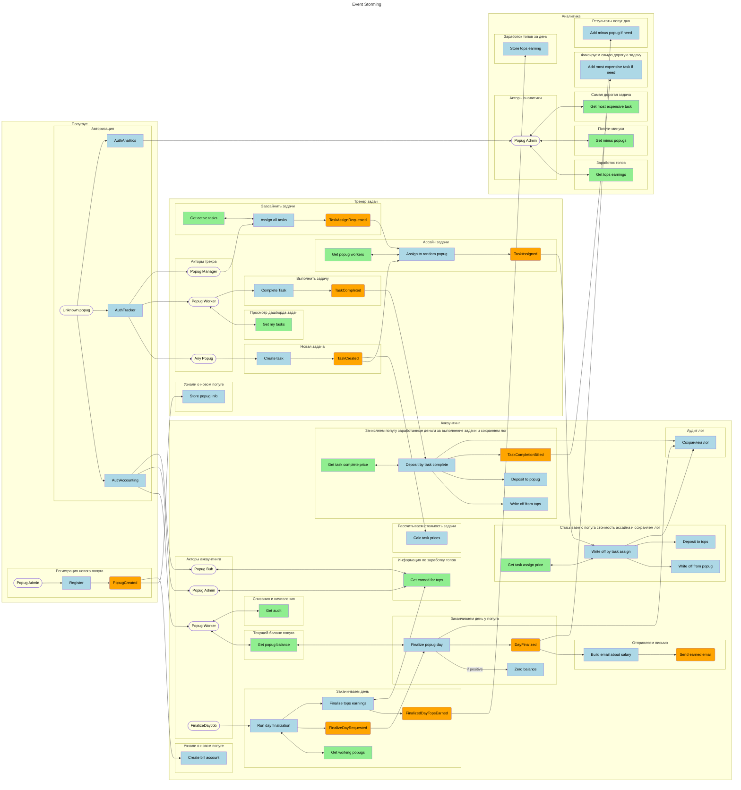

# Сервисы
## Попугаус (Auth Service)
* Синхронные запросы авторизации из других сервисов
* Асинхронные события о создании/изменении попуга
## Task Tracker
* Синхронные запросы для просмотра дашборда
* Асинхронные события о создании/изменении задания
## Accounting
* Синхронные запросы для просмотра дашборда
* Асинхронные события о финансовых операциях в сервисе
## Analytics
* Синхронные запросы для просмотра дашборда

# Бизнес события
## TaskCreated
* Producer: Task Tracker
* Consumers: Task Tracker, Accounting
## TaskAssigned
* Producer: Task Tracker
* Consumers: Accounting
## TaskCompleted
* Producer: Task Tracker
* Consumers: Accounting
## DayFinalized
* Producer: Accounting
* Consumer: Analytics, Email Service (Accounting)

# CUD
## PopugCreated
* Producer: Попугаус
* Consumers: Task Tracker, Accounting
* Data: PopugId, Role
## TaskAssignRequested
* Producer: Task Tracker
* Consumers: Task Tracker
* Data: TaskId
## TaskCompletionBilled
* Producer: Accounting
* Consumer: Analytics
* Data: CompletionPrice
## FinalizeDayRequested
* Producer: Accounting
* Consumers: Accounting
* Data: PopugId
## FinalizedDayTopsEarned
* Producer: Accounting
* Consumer: Analytics
* Data: TopsEarnedMoney